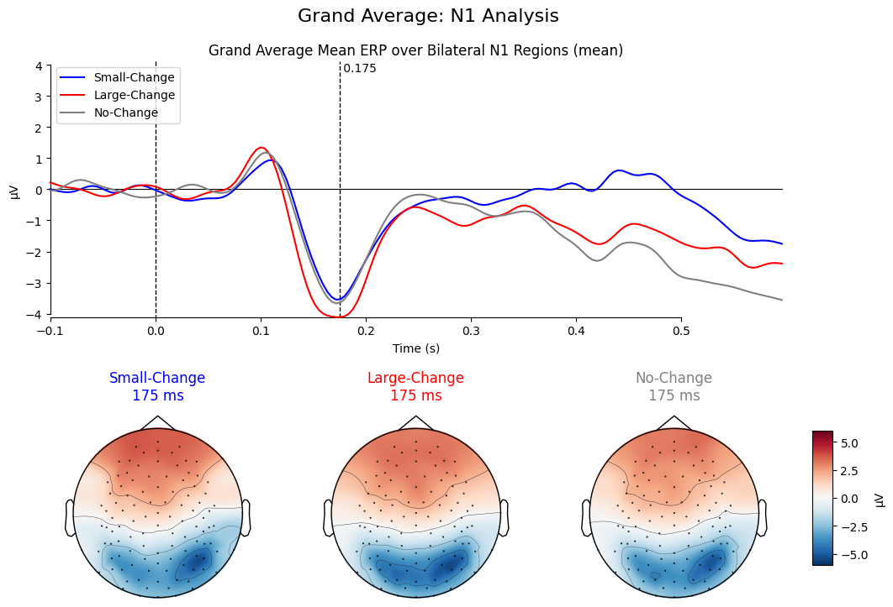

# The Neurobehavioral Basis of Numerical Processing



This repository contains the data and analysis scripts for a study investigating the neurobehavioral basis of the Parallel Individuation (PI) and Approximate Number System (ANS). The project analyzes EEG and behavioral data from 24 participants performing a numerical change detection task.

## Onboarding for New Research Assistants

Welcome to the project! Your first and most important task is to familiarize yourself with the scientific background of this research.

**Please start by reading the following document in its entirety:**
`study-info/previous_study_overview.txt`

This document details the original dissertation on which this project is based. It explains the core theories (PI vs. ANS), the experimental design, the stimuli used, the data processing steps, and the key findings. A thorough understanding of this document is essential for contributing to the project meaningfully.

## Environment Setup

The analysis scripts are written in Python. You will need to install several key libraries. You can install them using pip:

```bash
pip install mne pandas numpy tables scipy
```
**Note:** The `tables` library is required by `mne` to handle saving and loading metadata in the HDF5 format (`.h5` files).

## Datasets Overview

The raw data is processed into four primary datasets, each residing in its own directory. These directories contain the processing `code` and the resulting `derivatives` (processed data).

1.  **`eeg_all/`**
    *   **Description:** This dataset includes EEG data from **all** trials for all 24 subjects, regardless of whether their behavioral response was correct or incorrect.
    *   **Use Case:** Useful for analyses where trial-by-trial accuracy is not a factor or when analyzing error-related brain activity.

2.  **`eeg_acc=1/`**
    *   **Description:** This is a filtered subset of `eeg_all`. It includes data **only** from trials where the participant responded correctly (`Target.ACC == 1`).
    *   **Use Case:** The primary dataset for most analyses, as it focuses on brain activity related to successful numerical change detection.

3.  **`eeg_ds_all/`**
    *   **Description:** A downsampled version of the `eeg_all` dataset. Downsampling reduces the temporal resolution (sampling rate) of the EEG signal.
    *   **Use Case:** Reduces file size and significantly speeds up computational processing. Ideal for exploratory data analysis, rapid prototyping of scripts, or when high temporal precision is not critical.

4.  **`eeg_ds_acc=1/`**
    *   **Description:** A downsampled version of the `eeg_acc=1` dataset, containing only correct trials.
    *   **Use Case:** Combines the benefits of focusing on correct trials and the computational efficiency of downsampled data.

## Data Processing Pipeline

The analysis pipeline is designed as a series of scripts, where the output of one script serves as the input for the next.

### Stage 1: Initial Processing with `01_process_lab_data.py`

This is the foundational script of the project. A version of it exists within the `code/` directory of each of the four datasets.

**Function:** The script's main purpose is to take the raw experimental data, clean it, merge it, and transform it into a structured format suitable for neuroscientific analysis using the MNE-Python library.

**Key Inputs:** The script relies on several critical input files:

*   **Raw EEG Data (`.set` files)**
    *   **Location:** `lab_data/5 - processed/`
    *   **Description:** These are the primary EEG recordings for each subject, saved in the EEGLAB `.set` format.

*   **Behavioral Data (`.csv` files)**
    *   **Location:** `lab_data/Final Behavioral Data Files/data_UTF8/`
    *   **Description:** These files contain the trial-by-trial behavioral logs from the E-Prime experiment, including reaction times, response accuracy (`Target.ACC`), and experimental conditions.

*   **Usable Trials Index (`HAPPE_Usable_Trials.csv`)**
    *   **Location:** `lab_data/`
    *   **Description:** This is a crucial master file generated by the HAPPE pipeline. It specifies which segments (trials) in the raw EEG data are free from artifacts (like blinks or muscle noise) and are thus "usable" for analysis. The script uses the `Kept_Segs_Indxs` column to select valid trials.

*   **Electrode Locations (`AdultAverageNet128_v1.sfp`)**
    *   **Location:** `assets/Channel Location - Net128_v1.sfp/`
    *   **Description:** This file provides the 3D spatial coordinates for each of the 128 electrodes in the EEG cap. This information is essential for any spatial analysis, such as creating topographical maps (topomaps) of brain activity.

**Outputs:**

*   **Epochs Files (`*-epo.fif`):** The processed, segmented EEG data for each subject. An "epoch" is a slice of the EEG signal time-locked to a specific event (e.g., the presentation of a stimulus).
*   **Metadata Files (`*_metadata.h5`):** A file containing the corresponding behavioral data and trial information, precisely aligned with each epoch in the `.fif` file.

### Stage 2: Visualization and Analysis

The scripts numbered `02`, `03`, `04`, etc., in the `code/` directories perform the subsequent analysis steps. They load the `-epo.fif` files generated by the first script to:

*   Generate butterfly plots (`02_generate_butterfly_plots.py`)
*   Create topographic maps of brain activity at specific time points (`03_generate_topomaps.py`)
*   Perform source localization (e.g., LORETA) to estimate the origin of the neural signals (`04_generate_loreta_plots.py`) 